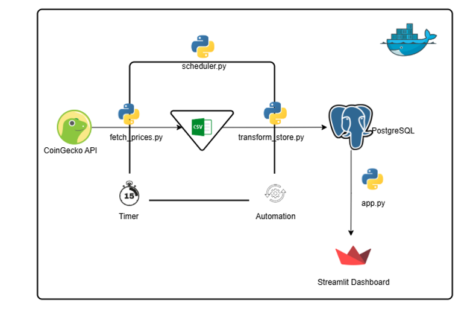
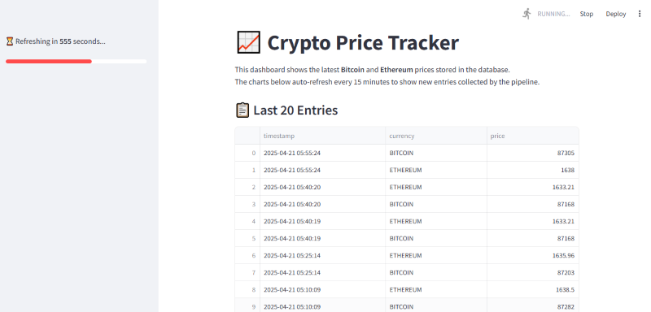
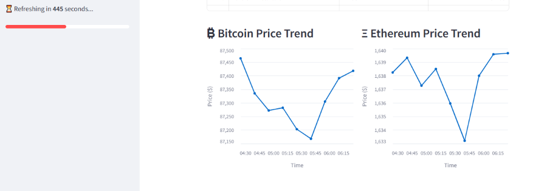

# Crypto Price Pipeline

**This project is a collaborative beginner-friendly group project** built under the **Beginner Review Cohort 1** of the [Data Engineering Community (DEC)](https://dataengineeringcommunity.com/).  
We're Team **DataForge** — a group of aspiring data engineers learning by building hands-on projects together.

---


This project is a lightweight but scalable crypto price tracking system that fetches real-time Bitcoin and Ethereum prices from the [CoinGecko API](https://www.coingecko.com/en/api), processes the data, stores it in both a CSV and PostgreSQL database, and visualizes it in a live-updating dashboard built with Streamlit.
It can be fully containerized with Docker and can be run on any platform with minimal setup.

Whether you're a data enthusiast, developer, or learner exploring ETL pipelines and dashboards, this project gives you a full, practical walk-through of data engineering essentials.

---

## Table of Contents

- [Features](#-features)
- [Architecture Overview](#-architecture-overview)
- [Data Dictionary](#-data-dictionary)
- [Why These Tools?](#-why-these-tools)
- [Getting Started](#-getting-started)
  - [Run Locally (Without Docker)](#run-locally-without-docker)
  - [Run with Docker Compose](#run-with-docker-compose)
- [Project Structure](#-project-structure)
- [Dashboard Preview](#-dashboard-preview)
- [Tech Stack](#-tech-stack)
- [Future Enhancements](#-future-enhancements)
- [Contributing](#-contributing)
- [License](#-license)

---

## Features

- Fetches Bitcoin and Ethereum prices via CoinGecko API
- Stores data in both `CSV` and `PostgreSQL`
- Automatically scheduled fetching using a custom scheduler
- Real-time dashboard with auto-refresh and charting
- Dockerized and portable
- Clean logging and modular design

---

## Architecture Overview




- The pipeline runs every 15 minutes via `scheduler.py`
- Data is saved in a CSV for simplicity and in PostgreSQL for querying and analytics
- The Streamlit dashboard reads from the PostgreSQL Database for quick visual rendering

---

## Data Dictionary

| Column     | Description                                             | Data Type  | Example                |
|------------|---------------------------------------------------------|------------|------------------------|
| `timestamp`| UTC time when the price was fetched                     | `datetime` | `2025-04-21 12:00:00`  |
| `currency` | Type of cryptocurrency (e.g., BTC, ETH)                 | `string`   | `BTC`                  |
| `price`    | Current price of the cryptocurrency in USD              | `float`    | `63321.24`             |

---

## Why These Tools?

| Tool | Why It Was Chosen |
|------|--------------------|
| **Python** | Widely used for scripting and data pipelines. |
| **CoinGecko API** | Free, reliable crypto API with no API key required. |
| **CSV** | Easy local file storage for basic inspection and visualization. |
| **PostgreSQL** | Robust, production-grade database for long-term storage and querying. |
| **Streamlit** | Instantly turns Python scripts into interactive dashboards. |
| **Docker** | Ensures consistency across development, test, and production. |
| **Docker Compose** | Allows orchestrating multiple services (pipeline + dashboard + DB) in one command. |

---

## Getting Started

> You'll need either Python (3.10+) or Docker installed.

---

### Run Locally (Without Docker)

#### 1. Clone the Repository

```bash
git clone https://github.com/<your-username>/crypto-price-pipeline.git
cd crypto-price-pipeline
```

#### 2. Create and Activate a Virtual Environment

```bash
python -m venv venv
source venv/bin/activate  # or venv\Scripts\activate on Windows
```

#### 3. Install Dependencies

```bash
pip install -r requirements.txt
```

#### 4. Set Environment Variables

Create a `.env` file with:

```env

# PostgreSQL Database Configuration
PG_HOST=your-db-host
PG_PORT=your-db-port
PG_USER=your-db-username
PG_PASSWORD=your-db-password
PG_DATABASE=your-db-name

# Crypto Settings
CRYPTOCURRENCIES=bitcoin,ethereum

# API URL
API_BASE_URL=https://api.coingecko.com/api/v3


```

#### 5. Start PostgreSQL (if not using Docker)

```bash
# On macOS or Ubuntu (example)
sudo service postgresql start
```

#### 6. Run the Pipeline

```bash
# Automatically run at intervals
python scripts/scheduler.py

# Or manually run each step:
python scripts/fetch_prices.py
python scripts/transform_store.py
```

#### 7. Launch the Dashboard

```bash
streamlit run dashboard/app.py
```

Visit [http://localhost:8501](http://localhost:8501)

---

### Run with Docker Compose

> Best for consistent, production-ready setup

#### 1. Build and Run

```bash
docker-compose up --build
```

This will:
- Start the `PostgreSQL` database
- Launch `scheduler.py` in the pipeline container
- Run the Streamlit dashboard

#### 2. Visit the Dashboard

[http://localhost:8501](http://localhost:8501)

#### 3. Stop the Services

```bash
docker-compose down
```

---

## Docker Usage Summary

| Command                        | Description                                 |
|--------------------------------|---------------------------------------------|
| `docker-compose up --build`    | Build and run all containers                |
| `docker-compose down`          | Stop all containers                         |
| `docker logs <container>`      | View container logs                         |
| `docker-compose ps`            | Check status of running services            |


---

## Project Structure

```
crypto-price-pipeline/
├── data/
│   └── prices.csv                # Stored prices (persisted locally or via volume)
├── logs/
│   └── transform_store.log       # Logging for transformations
├── scripts/
│   ├── fetch_prices.py           # Fetch data from CoinGecko API
│   ├── transform_store.py        # Clean and store into CSV/log
│   └── scheduler.py              # Scheduler for periodic fetch+store
├── dashboard/
│   └── app.py                    # Streamlit app for visualization
├── .env                          # Secrets like API keys (excluded from Git)
├── requirements.txt              # Python dependencies
├── Dockerfile                    # For running scripts/dashboard
├── docker-compose.yml            # Multi-service setup
├── .dockerignore                 # Ignore files for Docker context
├── .gitignore                    # Ignore unnecessary files for Git
└── README.md                     # Project instructions and documentation

```

---

## Dashboard Preview






The Streamlit dashboard includes:
- The last 20 price entries
- Two column charts:
  - Bitcoin (last 10 entries)
  - Ethereum (last 10 entries)
- A countdown timer for the next refresh


---

## Tech Stack

- **Language**: Python 3.10
- **API**: CoinGecko
- **Storage**: CSV & PostgreSQL
- **Scheduler**: `schedule` Python package
- **Dashboard**: Streamlit
- **Containerization**: Docker & Docker Compose
- **Logging**: `logging` module with rotating file handler

---

## Future Enhancements

- Add historical trend analysis
- Use Airflow or Prefect instead of custom scheduler
- Deploy dashboard to Streamlit Cloud
- Add CI/CD pipeline with GitHub Actions

---

## Contributing

We welcome feedback, improvements, or feature requests. Feel free to:

- Fork this repo

- Create a new branch

- Submit a pull request 

---

## Credits

Built by Team DataForge for Beginner Review Cohort 1.

A learning-focused project for aspiring data engineers.


---

## License

This project is licensed under the MIT License. See `LICENSE` for details.
```

